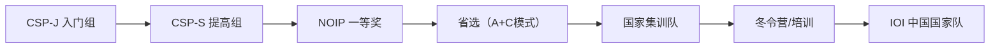

# CSP 与 OI 深度对比详解

> 本文档部分内容为 AI 生成，仅供参考与学习使用。

评分标准与评测机制

| 维度 | CSP（计算机软件能力认证） | OI（信息学奥林匹克） |
|------|----------------------------|------------------------|
| 评测方式 | 全自动机评系统，基于多组测试数据比对输出结果 | 全自动机评系统，采用测试点分值制，每题拆分为多个独立测试点 |
| 得分机制 | 每道编程题满分75分，按通过的测试点累计得分，部分正确可得部分分数 | 每题通常设3~5个测试点，每个测试点分值固定（如2~4分），通过即得分，不设过程分 |
| 评判维度 | 正确性、时间复杂度、空间复杂度三重约束，超时或超内存直接得0分 | 同CSP，但更强调算法最优性，暴力解法即使通过部分测试点，也难以获得满分 |
| 反馈机制 | 考试中不提供实时反馈，成绩于赛后统一公布 | 国际赛制（如IOI）支持实时反馈（AC/WA/RE/TLE），但国内NOIP/CSP-S仍为赛后统评 |
| 评分透明度 | CCF官方公布全国认证基准线（如2025年CSP-S一级线为131分），各省按平均分动态调整名额 | NOIP评奖采用“基准线+比例浮动”机制：一等奖全国基准线20%，各省根据成绩分布上下浮动，确保排序一致性 |

备考资源与官方支持体系

官方推荐教材与资料

- CSP-J/S 初赛  
  - 《全国青少年CSP-J编程竞赛真题解析（2025版）》  
  - 《信息学奥赛CSP-J初赛通关手册》（含10年真题+解析）  
  - 《信息学奥赛一本通·初赛篇（C++版）》  

- CSP-S 提高组  
  - 《信息学奥赛CSP通关之路——CSP-J/S第一轮原创全真模拟试卷集（2025）》  
  - 《信息学奥赛高分训练秘笈·实战篇》  

在线学习平台

| 平台 | 功能特点 |
|------|----------|
| 洛谷 (luogu.com.cn) | 海量真题分类题库、AI自动评测、题解社区、模拟赛系统 |
| CCF NOI官网 | 发布考纲、认证通知、历年真题、培训资源链接 |
| C语言网 | 在线编译、自动批改、C++语法专项训练 |
| 斯坦星球OJ | AI定制化练习、错题本功能、模拟真实考试环境 |

竞赛路径与人才选拔机制

CSP → OI → IOI 进阶路径

- 省选机制：2025年起，广东省采用 NOIP成绩（40%）+ 省选一试（30%）+ 省选二试（30%） 的加权模式计算总分
- 国家队选拔：通过NOI全国决赛（每年7月）选拔前50名进入国家集训队，经多轮测试与冬令营考核，最终选出6人代表中国参加IOI
- 浙江优势：2025年IOI国家队预备队30人中，浙江占7人，杭州4人来自重点高中，初中阶段已展现突出潜力

考试形式与题型演变（2020–2025）

| 年份 | CSP变化 | OI变化 |
|------|---------|--------|
| 2020 | CSP-S题型由3题增至4题，与NOIP提高组统一 | NOIP同步改为4题，取消笔试，全面机试 |
| 2022 | 引入部分分机制，鼓励写出部分正确逻辑 | 强化数据结构与图论占比，减少纯数学题 |
| 2024 | 增加代码鲁棒性评分权重，强调边界条件处理 | 省选引入多省联合命题，评测环境统一为NOI Linux2.0 |
| 2025 | 题型更贴近工程实践，出现文件读写、多线程模拟等场景 | 增加交互式题目（Interactive Problem）试点，模拟IOI风格 |

> 注：CSP-S近年题型已逐步向NOI靠拢，但不涉及机器学习、大数据等非传统算法领域，仍聚焦经典算法与数据结构。

证书价值与社会认可

| 应用场景 | CSP证书 | OI获奖（NOIP一等奖及以上） |
|----------|---------|-----------------------------|
| 高校强基计划 | 部分985高校（如华中科技大学）将其作为重要参考，可降1~2档录取 | 直接入围清北、中科大、浙大等校强基计划，部分可免初试 |
| 综合评价招生 | 浙江省属高校（如杭电、浙师大）认可CSP-S一等奖，可获降分优惠 | NOIP一等奖为核心奖项，在“三位一体”招生中具压倒性优势 |
| 企业招聘 | 百度、华为、腾讯等企业将CSP成绩作为实习生筛选依据，高分者直通面试 | 国家集训队成员被直接签约，年薪可达50万+，属“天才少年”计划重点对象 |
| 升学加分 | 无省级统一加分政策 | 多省（含浙江）对NOIP一等奖获得者给予高考加分或保送资格 |
